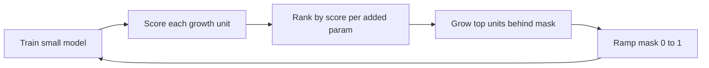

# Organic Growth of Transformers — Project Brief

Sep 25, 2026 · @Alireza

## Summary

We will start from a small transformer and grow it during training, adding capacity only where a metric says it is needed. Growth is function-preserving, so the loss does not jump at each growth event. The result is a heterogeneous architecture shaped by the data, not a stack of identical layers.

**Hypothesis.** Metric-driven, non-uniform growth reaches the quality of a uniformly scaled model with fewer parameters, or better quality at equal parameters, at matched training compute.

**Motivation.** Pruning studies show many LLM layers are redundant after training. Gromov et al. (2024) removed a large fraction of the deeper layers (those just before the final one) with small losses on knowledge QA after a short healing fine-tune; ShortGPT and "Transformer Layers as Painters" point the same way. If capacity is unevenly useful, allocating it uniformly wastes parameters.

## Prior work

The growth operators exist; the gap is adaptive, non-uniform growth of transformers at LM scale. Adaptive methods were shown mostly on MLPs and CNNs, and LLM growth methods grow uniformly on a schedule.

| Work | What it does | Relevance |
| --- | --- | --- |
| Net2Net (Chen et al., 2016) | Split units, divide outgoing weights; identity-init new layers | Our original splitting idea |
| Network Morphism (Wei et al., 2016) | General function-preserving morphisms | Operator design |
| Splitting Steepest Descent (Liu et al., 2019); Firefly (Wu et al., 2020) | Split neurons whose splitting-matrix eigenvalue is negative | Metric M2 |
| GradMax (Evci et al., 2022) | New neurons initialized to maximize gradient norm | Metric M1 |
| Self-Expanding NNs (Mitchell et al., 2023) | Natural-gradient score decides when and where to grow | Metric M4 |
| TINY (Verbockhaven et al., 2024) | Detects expressivity bottlenecks, adds neurons there | Metric M3 |
| Progressive stacking (Gong et al., 2019); G\_stack (Du et al., 2024) | Grow depth by copying layers | Depth baseline |
| bert2BERT (2022), LiGO (2023), Staged Training (Shen et al., 2022) | Uniform width/depth growth of transformers | Uniform-growth baselines |
| MSG (Yao et al., 2023) | Masked, strictly function-preserving transformer growth | Our growth operator |
| OpenELM (2024), DeLighT (2021) | Hand-designed non-uniform layer widths | Non-uniform baseline |
| Sheared LLaMA, Minitron | Prune a large model into a small non-uniform one | Competitor for the parameter-efficiency claim |

These references are from memory; verify citations and check for 2025–2026 follow-ups before writing up.

## Claims and success criteria

The project tests two separate claims; both are reported, and neither depends on the other.

- **Claim A — compute efficiency.** Growth reaches the final validation loss of a from-scratch model of the same final size with fewer total training FLOPs, counting the FLOPs spent while small.
- **Claim B — parameter efficiency.** Metric-driven growth gives lower validation loss than a uniform model with the same parameter count and the same training FLOPs, or equal loss with fewer parameters.

**The metric must earn its place.** Metric-driven growth must beat growth at random locations and uniform growth under the same budget. If it does not, the result is about growth, not about the metric.

**Evidence required:** results at three or more scales, plotted as loss vs parameters and loss vs FLOPs, with at least 2–3 seeds at the smallest scale to size the noise.

## Growth mechanism

Growth happens in coupled units, not single matrices, and each new unit enters behind an MSG-style mask that starts at 0.

| Growth unit | Matrices touched | What "grow" means |
| --- | --- | --- |
| FFN width (per layer) | L1 rows + L2 columns (+ gate for SwiGLU) | Add k hidden neurons |
| Attention heads (per layer) | Q, K, V columns + O rows | Add a head |
| QK head dim (per layer) | Q, K | Widen query/key dimension |
| Depth | A whole block | Out of scope for v1; layer count fixed at the standard for each model size |
| d\_model | Every matrix, embeddings, LayerNorm | Global; out of scope for v1 |

**Operator.** New weights are randomly initialized (or initialized from the metric, e.g. GradMax directions). Their output is multiplied by a mask that ramps linearly from 0 to 1 over a set number of steps, so the function is exactly preserved at growth time and symmetry is broken from the start.

**Why not pure splitting.** Copying a unit and dividing outgoing weights by m gives copies with identical gradients, so they never diverge. Splitting also never helps a purely linear map at second order. The splitting variant (±δ along the splitting eigenvector, Liu et al.) stays available as an alternative operator for FFN neurons.

**Housekeeping at each growth event:** extend Adam moments with zeros for new parameters, keep LayerNorm statistics exact (as MSG does), and consider a short learning-rate re-warmup for the new parameters only.

**Growth loop:**



The loop repeats every N steps (or when a score crosses a threshold) until the parameter budget is reached, then training continues to the FLOP budget.

## Candidate metrics

Each metric estimates the loss decrease from growing a unit; three principled metrics (M1–M3) are the main contenders, and M5–M6 are cheap baselines.

| ID | Metric | Signal | Applies to | Cost |
| --- | --- | --- | --- | --- |
| M1 | GradMax score | Top singular values of E\[g\_out · x\_inᵀ\] through the nonlinearity | FFN width, heads | Low (reuses backprop) |
| M2 | Splitting eigenvalue | Most negative eigenvalue of each neuron's splitting matrix, summed over top-k neurons | FFN neurons | High (Hessian-vector products, power iteration) |
| M3 | TINY bottleneck | Norm of the desired output update the best ΔW cannot express | FFN, attention projections | Medium (least-squares solve) |
| M4 | Natural expansion score (SENN) | Increase in gᵀF⁻¹g from a hypothetical expansion | All units, incl. depth | Medium–high (K-FAC Fisher) |
| M5 | Gradient SNR / conflict | Adam ‖m‖²/Σv per unit, or per-example gradient cosine | All units | Near zero |
| M6 | Spectral saturation | Stable rank ‖W‖²\_F/‖W‖²\_2, activation effective rank, dormant-neuron fraction | All units | Low, no gradients |
| M7 | Block influence (reverse) | 1 − cos(x\_in, x\_out) per layer | Layers | Low; a do-not-grow filter |

Splitting matrix for M2, for a neuron with input weights w and activation σ:

```latex
S(w) = \mathbb{E}_x\left[\, g(x)\, \sigma''(w^\top x)\, x x^\top \right], \qquad \Delta L \approx \tfrac{\varepsilon^2}{2}\, \lambda_{\min}(S)
```

**Notes on use.**

- First-order scores (M1, M5) fade near convergence; M2 works exactly there. Expect M1 early, M2 late.
- M3 separates "needs capacity" from "needs more training", which is the distinction that matters.
- M6 and M7 measure saturation or importance, not need; use them as filters or tie-breakers.
- **Normalize every score by added parameters or FLOPs**, or large units always win.
- Estimate on held-out batches and smooth with an EMA over several steps; a single batch is too noisy to trigger an irreversible growth.

**Oracle validation (run first).** At small scale, grow each candidate unit in isolation, train briefly, and record the real loss drop. Rank candidates by each metric and report Spearman correlation with the oracle ranking. This decides which metrics go into the full loop.

## Experimental plan

Five stages (0–4), each a go/no-go gate for the next; Stage 1 is cheap and decides whether the idea is viable.

| Stage | Scale | Question | Go criterion |
| --- | --- | --- | --- |
| 0. Infrastructure | \~10M params | Is growth exactly function-preserving? | Loss and logits identical before/after growth (tolerance \~1e-5); training stable after the mask ramp |
| 1. Metric validation | 10M–50M | Which metric predicts real loss drops? | At least one metric has clear positive Spearman correlation with the oracle ranking |
| 2. Ablation | 10M–50M | Does the metric matter, at matched FLOPs and final size? | Metric-driven growth beats random-location and uniform growth beyond seed noise |
| 3. GPT-2 scale | 124M and 350M | Do Claims A and B hold? | Gains persist vs a strong from-scratch baseline |
| 4. Scaling and analysis | 3+ sizes (e.g. 30M, 124M, 350M, optionally 774M) | Does the gain grow, hold or shrink with scale? Where does the metric grow? | Trend plotted; allocation pattern analysed |

**Stage 2 arms, all at matched FLOPs and final parameter count:** (a) metric-driven growth, (b) same schedule at random locations, (c) uniform growth (MSG-style), (d) from scratch at the final size.

**Data.** FineWeb (or FineWeb-Edu) tokenized with the GPT-2 tokenizer; a fixed held-out validation split. OpenWebText is an acceptable fallback.

**Starting point for code.** nanoGPT or llm.c-style training loop; modded-nanoGPT as the reference for a strong, fast baseline recipe.

## Baselines, controls and evaluation

Every comparison is at matched training FLOPs, and baselines get the same recipe, data and hyperparameter tuning as the grown models.

**Baselines**

- From-scratch uniform model at the grown model's final parameter count.
- From-scratch uniform model at the same FLOP budget (compute-optimal size if different).
- Uniform growth on the same schedule (MSG-style).
- Growth at random locations on the same schedule.
- Hand-designed non-uniform widths (OpenELM-style linear layer-wise scaling).
- Optional for Claim B: prune a larger model to the same size (Minitron/Sheared-LLaMA-style), matched on total FLOPs.

**Controls**

- Count all FLOPs, including the small phase and metric computation.
- Do not compare against the original 2019 GPT-2 numbers; modern recipes beat them easily.
- Tune learning rate for each baseline at the smallest scale; do not give the grown model extra tuning.

**Measurements**

- Primary: validation loss (and perplexity) on the held-out split.
- Secondary: HellaSwag and LAMBADA; most other benchmarks are near chance at this scale.
- Cost: wall-clock time and tokens/s, since heterogeneous shapes can reduce GPU throughput.
- Analysis: final per-layer allocation (FFN width, head count per layer) and when each growth event fired.

## Risks and open questions

The biggest risk is that Claim B gains are small, since uniform models are hard to beat and hand-designed non-uniform schemes already exist.

| Risk | Mitigation |
| --- | --- |
| Claim B gains are within seed noise | Report Claim A too; publish the allocation analysis and oracle-correlation results as findings in their own right |
| Metric only beats random growth at small scale | Stage 4 scaling curve decides; report honestly either way |
| Redundancy seen by Gromov et al. appears only in large, long-trained models | Frame motivation carefully; do not claim GPT-2 results reproduce it |
| Undertrained baselines inflate gains | Strict FLOP matching and equal tuning (see Controls) |
| Heterogeneous shapes slow training on GPU | Round unit sizes to multiples of 64 or 128; report tokens/s |
| Metric compute cost eats the savings | Count it in FLOPs; compute metrics on a subsample every N steps |

**Open questions**

- [x] Growth schedule: fixed interval vs score threshold (SENN-style)? Decided: fixed interval for development and the ablation; the metric decides only where to grow.
- [x] Grow depth in v1, or width only (FFN + heads)? Decided: width only; layer count fixed at the standard for each model size.
- [x] Should the model also shrink units the metric marks as idle (grow-and-prune)? Decided: no pruning for now.
- [x] Compute budget available: GPU type and hours for Stage 3–4. Decided: current scope is development and the ablation (Stages 0–2) on a single H100 NVL; the Stage 3–4 budget is set once the surviving metrics are known.

## Build instructions

Build a PyTorch codebase that supports Stages 0–2 end to end first; GPT-2-scale runs come after the ablation gate passes.

**Suggested layout**

| Module | Responsibility |
| --- | --- |
| `model/` | GPT-style transformer with per-layer FFN width, head count and head dim as independent variables; every growable unit carries a mask |
| `growth/operators.py` | Add FFN neurons, heads and head dims behind a 0-initialized mask; mask ramp scheduler; optional ±δ split for FFN neurons |
| `growth/optimizer.py` | Rebuild AdamW param groups after growth; zero-init moments; optional LR re-warmup for new params |
| `metrics/` | One file per metric M1–M7, sharing an interface: `score(model, batches) -> {unit_id: score}`, normalized per added param |
| `growth/controller.py` | Growth loop: when to score, ranking, budget, and logging of every growth event |
| `oracle/` | Stage 1: grow one unit at a time, short train, record real loss drop, compute Spearman vs each metric |
| `train.py` | nanoGPT-style loop; FLOP counter that includes metric computation; checkpointing across shape changes |
| `configs/` | One config per experiment arm; seeds; scale presets (10M, 30M, 124M, 350M) |
| `analysis/` | Loss vs FLOPs and loss vs params plots; per-layer allocation heatmaps |

**Required tests (before any experiment)**

- [ ] Function preservation: logits match before and after every growth operator, with mask at 0.
- [ ] New parameters receive non-zero gradients once the ramp starts (they get none while the mask is exactly 0, so the ramp begins on the first step after growth).
- [ ] Optimizer state survives growth; no parameter left out of AdamW.
- [ ] Checkpoint save/load works across shape changes.
- [ ] FLOP counter checked against a hand calculation for one config.

**Order of work:** model + operators + tests → M1, M5, M6 (cheap) → oracle harness → M3 → M2 → controller → Stage 2 ablation. M4 (Fisher-based) is optional and comes last.

**Logging:** every run logs growth events (step, unit, score, params added), validation loss curve, cumulative FLOPs and tokens/s, e.g. to Weights & Biases or CSV.
